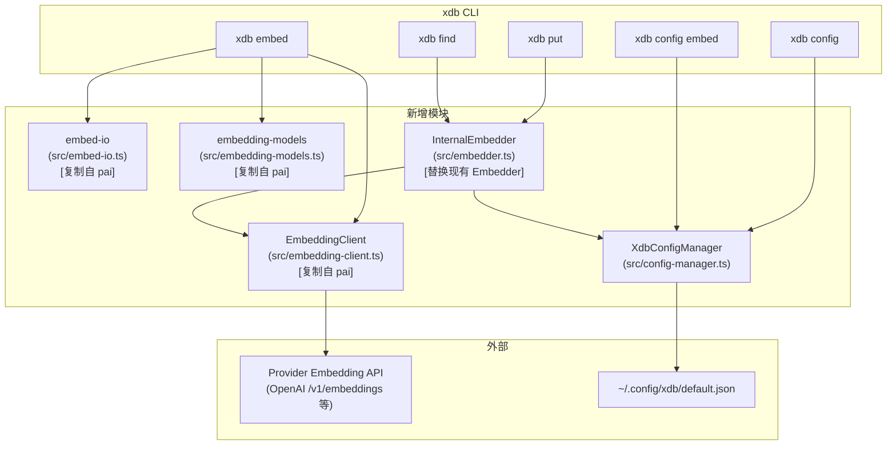

# 设计文档：xdb embed 服务

## 概述

本设计为 xdb 新增独立的向量化（Embedding）服务，使 xdb 不再依赖外部 `pai embed` 进程，直接通过 HTTP 调用 Provider 的 Embedding API 完成向量计算。

核心设计原则：
1. **复用 pai 的成熟实现**：`EmbeddingClient`、`embed-io`（parseBatchInput/formatEmbeddingOutput/vectorToHex）、`embedding-models`（token 截断）直接从 pai 复制，不重新开发
2. **独立配置**：xdb 使用 `~/.config/xdb/default.json`，与 pai 配置完全隔离
3. **内部接口高效**：`Internal_Embedder` 直接返回 `number[]`，无 hex 编码开销，直接传给 lancedb
4. **CLI 行为一致**：`xdb embed` 的输出格式与 `pai embed` 完全相同（hex 编码向量）

## 架构



数据流（put/find 内部调用）：
1. `put`/`find` 命令创建 `InternalEmbedder`
2. `InternalEmbedder` 从 `XdbConfigManager` 加载 provider/model/apiKey
3. `InternalEmbedder` 调用 `EmbeddingClient.embed()` 获取 `number[]`
4. 直接将 `number[]` 传给 lancedb（无 hex 编码/解码开销）

数据流（xdb embed CLI）：
1. 解析输入（位置参数 / stdin）
2. 从 `XdbConfigManager` 加载配置
3. 调用 `EmbeddingClient.embed()` 获取 `number[][]`
4. 通过 `formatEmbeddingOutput`（来自 embed-io）格式化为 hex 编码输出

## 组件与接口

### 1. XdbConfigManager (`src/config-manager.ts`)

```typescript
export interface XdbProviderConfig {
  name: string;
  apiKey?: string;
  baseUrl?: string;
  api?: string; // 'azure-openai' 等
}

export interface XdbConfig {
  defaultEmbedProvider?: string;
  defaultEmbedModel?: string;
  providers: XdbProviderConfig[];
}

export class XdbConfigManager {
  constructor(configPath?: string); // 默认 ~/.config/xdb/default.json

  async load(): Promise<XdbConfig>;
  async save(config: XdbConfig): Promise<void>;

  /** 解析 provider 凭证：环境变量 XDB_<PROVIDER>_API_KEY > 配置文件 apiKey */
  async resolveApiKey(providerName: string): Promise<string>;

  /** 获取当前 embed 配置（provider + model + providerConfig） */
  async resolveEmbedConfig(): Promise<{
    provider: string;
    model: string;
    providerConfig: XdbProviderConfig;
    apiKey: string;
  }>;
}
```

### 2. InternalEmbedder (`src/embedder.ts`)

替换现有的 `Embedder` 类（原来通过 `spawnCommand('pai', ...)` 调用），改为直接调用 `EmbeddingClient`：

```typescript
export class Embedder {
  constructor(private configManager?: XdbConfigManager);

  /** 单条文本嵌入，直接返回 number[] */
  async embed(text: string): Promise<number[]>;

  /** 批量文本嵌入，直接返回 number[][] */
  async embedBatch(texts: string[]): Promise<number[][]>;
}
```

关键变化：
- 移除 `spawnCommand('pai', ['embed', '--json'], ...)` 调用
- 移除 `hexToVector` 解码（原来 pai 返回 hex，现在直接得到 number[]）
- 直接调用 `EmbeddingClient.embed()`
- 错误类型保持 `XDBError`（与现有代码一致）

### 3. EmbeddingClient (`src/embedding-client.ts`)

直接从 pai 复制 `src/embedding-client.ts`，仅做以下调整：
- 将 `PAIError` 替换为 `XDBError`（xdb 的错误类型）
- 将 `ExitCode` 枚举替换为 xdb 的错误码常量（`RUNTIME_ERROR = 1`、`PARAMETER_ERROR = 2`）

接口保持不变：
```typescript
export class EmbeddingClient {
  constructor(config: EmbeddingClientConfig);
  async embed(request: EmbeddingRequest): Promise<EmbeddingResponse>;
  static resolveEndpoint(provider: string, baseUrl?: string): string;
  static resolveAzureEndpoint(baseUrl?: string, model?: string, providerOptions?: Record<string, any>): string;
}
```

### 4. embed-io (`src/embed-io.ts`)

直接从 pai 复制 `src/embed-io.ts`，仅替换错误类型：
- `PAIError` → `XDBError`
- `ExitCode.PARAMETER_ERROR` → `PARAMETER_ERROR`

导出函数：
```typescript
export function vectorToHex(vec: number[]): string[];
export function parseBatchInput(raw: string): string[];
export function formatEmbeddingOutput(result: EmbeddingResponse, options: { json: boolean; batch: boolean }): string;
```

### 5. embedding-models (`src/embedding-models.ts`)

直接从 pai 复制 `src/embedding-models.ts`，无需修改（无错误类型依赖）：
```typescript
export const EMBEDDING_MODEL_LIMITS: Record<string, number>;
export function estimateTokens(text: string): number;
export function truncateText(text: string, model: string): TruncateResult;
```

### 6. xdb config 命令 (`src/commands/config.ts`)

新增顶层 `config` 命令：

```typescript
// xdb config（无子命令）：显示完整当前配置
// xdb config embed --set-provider <name>
// xdb config embed --set-model <model>
// xdb config embed --set-key <apiKey>
// xdb config embed --set-base-url <url>
```

`xdb config`（无子命令）输出格式（人类可读）：
```
Embed Configuration:
  provider:  openai
  model:     text-embedding-3-small
  base-url:  (default)
  api-key:   sk-...****

Available Policies:
  hybrid/knowledge-base
    engines:    LanceDB + SQLite
    fields:     content [similar, match]
    autoIndex:  yes
  ...
```

`xdb config --json` 输出格式：
```json
{
  "embed": {
    "provider": "openai",
    "model": "text-embedding-3-small",
    "baseUrl": null,
    "hasApiKey": true
  },
  "policies": [...]
}
```

### 7. xdb embed 命令 (`src/commands/embed.ts`)

新增 `embed` 顶层命令，行为与 `pai embed` 完全一致：

```
xdb embed [text] [--batch] [--json] [--input-file <path>]
```

输入解析（与 pai embed 相同）：
- 位置参数 → 直接使用
- stdin（非 TTY）→ 读取 stdin
- `--input-file` → 读取文件

输出格式（与 pai embed 相同，hex 编码）：
- 无 `--json`：每行一个 hex 数组
- `--json` 单条：`{ "embedding": [...hex], "model": "...", "usage": {...} }`
- `--json` 批量：`{ "embeddings": [[...hex], ...], "model": "...", "usage": {...} }`

### 8. xdb policy list 废弃

在 `src/commands/policy.ts` 的 `list` 子命令中添加废弃提示：
```
[Deprecated] xdb policy list is deprecated. Use `xdb config` instead.
```
然后仍然输出原有内容（向后兼容）。

## 数据模型

### XdbConfig（配置文件结构）

```json
{
  "defaultEmbedProvider": "openai",
  "defaultEmbedModel": "text-embedding-3-small",
  "providers": [
    {
      "name": "openai",
      "apiKey": "sk-...",
      "baseUrl": null
    },
    {
      "name": "azure-openai",
      "apiKey": "...",
      "baseUrl": "https://my-resource.openai.azure.com",
      "api": "azure-openai"
    }
  ]
}
```

配置文件路径：`~/.config/xdb/default.json`

### 凭证解析优先级

```
XDB_<PROVIDER>_API_KEY 环境变量
    ↓ (未找到)
XDB_Config.providers[name].apiKey
    ↓ (未找到)
XDBError: 未配置凭证
```

环境变量名规则：provider 名称转大写，连字符替换为下划线，加前缀 `XDB_` 和后缀 `_API_KEY`。
例：`openai` → `XDB_OPENAI_API_KEY`，`azure-openai` → `XDB_AZURE_OPENAI_API_KEY`

### Embedding API 端点解析

| 场景 | 端点 |
|------|------|
| provider=openai，无 baseUrl | `https://api.openai.com/v1/embeddings` |
| 任意 provider，有 baseUrl | `{baseUrl}/v1/embeddings` |
| api=azure-openai，有 baseUrl | `{baseUrl}/openai/deployments/{model}/embeddings?api-version={version}` |
| 未知 provider，无 baseUrl | 参数错误 |

### 内部向量传递（无 hex 编码）

```
InternalEmbedder.embed(text)
    → EmbeddingClient.embed({ texts: [text], model })
    → EmbeddingResponse.embeddings[0]  // number[]
    → 直接传给 lancedb（new Float32Array(vector)）
```

原来的流程（已废弃）：
```
Embedder.embed(text)
    → spawnCommand('pai', ['embed', '--json'], text)
    → JSON.parse(stdout).embedding  // string[] (hex)
    → hexToVector(hex)              // number[]
    → 传给 lancedb
```

## 正确性属性

*正确性属性是一种在系统所有合法执行中都应成立的特征或行为——本质上是关于系统应该做什么的形式化陈述。属性是人类可读规范与机器可验证正确性保证之间的桥梁。*

### Property 1: XdbConfig 序列化 round-trip

*For any* 包含 `defaultEmbedProvider`、`defaultEmbedModel`、`providers` 数组的 XdbConfig 对象，序列化为 JSON 后再反序列化应得到等价的对象（所有字段不丢失、不变形）。

**Validates: Requirements 1.2, 1.3, 1.4**

### Property 2: 非法 JSON 配置文件总是返回错误

*For any* 不是合法 JSON 的字符串，当 Config_Manager 尝试将其作为配置文件解析时，应总是返回错误（不会静默忽略或返回空配置）。

**Validates: Requirements 1.6**

### Property 3: embed 配置写入 round-trip

*For any* 合法的 provider 名称和 model 名称，通过 Config_Embed_Command 写入后再读取，应得到相同的 provider 和 model 值。

**Validates: Requirements 2.1, 2.3, 2.4**

### Property 4: 端点 URL 构建正确性

*For any* baseUrl 字符串（含或不含尾部斜杠），EmbeddingClient 构建的标准端点应为 `{baseUrl.trimEnd('/')}/v1/embeddings`；对于 Azure 端点，应包含 `/openai/deployments/{model}/embeddings` 路径。

**Validates: Requirements 3.3, 3.6**

### Property 5: 未知 provider 无 baseUrl 总是返回参数错误

*For any* 不在已知 provider 列表中的 provider 名称，且未提供 baseUrl 时，EmbeddingClient 构建端点应总是抛出参数错误。

**Validates: Requirements 3.5**

### Property 6: HTTP 错误状态码总是返回错误

*For any* HTTP 4xx 或 5xx 状态码，EmbeddingClient 应总是返回错误（不会将错误响应当作成功处理）。

**Validates: Requirements 3.7**

### Property 7: API 响应按 index 排序

*For any* 包含乱序 index 的 Embedding API 响应，EmbeddingClient 返回的向量数组顺序应与输入文本顺序一致（按 index 升序排列）。

**Validates: Requirements 3.9**

### Property 8: 凭证解析优先级

*For any* provider 名称，当环境变量 `XDB_<PROVIDER>_API_KEY` 存在时，resolveApiKey 应总是返回环境变量的值，而不是配置文件中的 apiKey（即使两者都存在）。

**Validates: Requirements 4.1, 4.2**

### Property 9: embedBatch 输出长度与输入一致

*For any* 非空字符串数组，Internal_Embedder.embedBatch 返回的 number[][] 长度应等于输入数组的长度（每个输入文本对应一个向量）。

**Validates: Requirements 5.2**

### Property 10: Internal_Embedder 返回 number[] 而非 string[]

*For any* 输入文本，Internal_Embedder.embed 返回的数组中每个元素应为 number 类型（不是 string，即无 hex 编码）。

**Validates: Requirements 5.5**

### Property 11: 批量 JSON 解析有效性

*For any* 字符串，当该字符串是合法的 JSON 字符串数组时，parseBatchInput 应正确提取所有字符串元素；当该字符串不是合法的 JSON 字符串数组时，parseBatchInput 应返回错误。

**Validates: Requirements 6.6**

### Property 12: formatEmbeddingOutput JSON 结构完整性

*For any* EmbeddingResponse（含向量、model、usage），formatEmbeddingOutput 在 json=true 时应输出合法 JSON，单条包含 `embedding` 字段，批量包含 `embeddings` 字段，且均包含 `model` 和 `usage` 字段。

**Validates: Requirements 6.4, 6.5**

## 错误处理

| 场景 | 退出码 | 错误类型 |
|------|--------|---------|
| 未配置 provider 或 model | 2 | PARAMETER_ERROR |
| 未知 provider 且无 baseUrl | 2 | PARAMETER_ERROR |
| 未配置凭证 | 2 | PARAMETER_ERROR |
| --set-key/--set-base-url 时无 defaultEmbedProvider | 2 | PARAMETER_ERROR |
| 批量 JSON 格式错误 | 2 | PARAMETER_ERROR |
| 网络请求失败 | 1 | RUNTIME_ERROR |
| API 返回 HTTP 错误 | 1 | RUNTIME_ERROR |
| 配置文件 JSON 格式错误 | 1 | RUNTIME_ERROR |

注：xdb 的错误码与 pai 不同（xdb: RUNTIME_ERROR=1, PARAMETER_ERROR=2；pai: PARAMETER_ERROR=1, RUNTIME_ERROR=2）。复制 EmbeddingClient 时需替换错误类型。

## 测试策略

pai 已有完整的 embed 测试套件，xdb 可以大量移植。由于核心模块（EmbeddingClient、embed-io、embedding-models）直接从 pai 复制，对应测试也可以直接移植，仅需替换错误类型（`PAIError` → `XDBError`，`ExitCode` → xdb 错误码常量）。

### 属性测试（Property-Based Testing）

使用 `fast-check` 库，每个属性至少运行 100 次迭代。测试文件放在 `vitest/pbt/` 目录（扁平结构，无子目录）。

| 文件 | 来源 | 属性 |
|------|------|------|
| `vitest/pbt/embed-config-roundtrip.pbt.test.ts` | 新增 | Property 1, 2, 3 |
| `vitest/pbt/embedding-client.pbt.test.ts` | 移植自 pai `pbt/baseurl-endpoint.pbt.test.ts` + 新增 | Property 4, 5, 6, 7 |
| `vitest/pbt/embed-credentials.pbt.test.ts` | 新增 | Property 8 |
| `vitest/pbt/embedder.pbt.test.ts` | 新增 | Property 9, 10 |
| `vitest/pbt/embed-io.pbt.test.ts` | 移植自 pai `pbt/batch-json-parsing.pbt.test.ts` + `pbt/json-output.pbt.test.ts` | Property 11, 12 |

每个属性测试标注：
```typescript
// Feature: embed-service, Property N: <property_text>
```

### 单元测试

测试文件放在 `vitest/unit/` 目录（扁平结构，无子目录）。

| 文件 | 来源 | 覆盖内容 |
|------|------|---------|
| `vitest/unit/config-manager.test.ts` | 新增 | 配置文件不存在返回默认配置、目录自动创建、凭证解析优先级 |
| `vitest/unit/embedder.test.ts` | 替换现有（移除 pai spawn mock，改为 mock EmbeddingClient） | embed/embedBatch 行为、错误传播 |
| `vitest/unit/embedding-client.test.ts` | 移植自 pai `unit/embedding-client.test.ts`（替换 PAIError → XDBError） | OpenAI/Azure 端点调用、请求头、错误处理 |
| `vitest/unit/embed-command.test.ts` | 移植自 pai `unit/embed-command.test.ts`（替换配置 mock） | CLI 输入解析、输出格式、截断警告、错误退出码 |
| `vitest/unit/config-command.test.ts` | 新增 | `xdb config` 输出包含 embed 配置和 policy 列表 |

### 测试框架

- 测试框架：vitest（复用现有 `vitest.config.ts`）
- 属性测试库：fast-check（已在 xdb devDependencies 中）
- HTTP mock：`vi.fn()` mock `globalThis.fetch`
- 文件系统：使用临时目录（`os.tmpdir()`）避免 mock 复杂度
