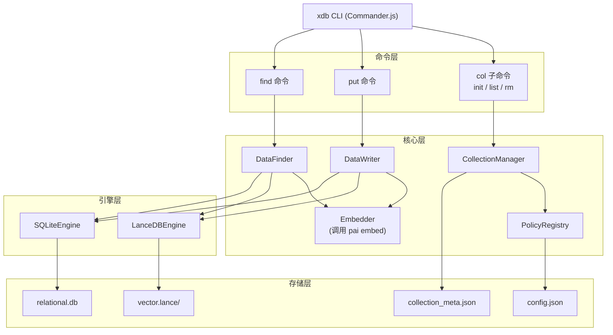

# 设计文档：xdb 核心功能 (Phase 1)

## 概述

xdb 是一个意图驱动的数据中枢 CLI 工具，内部透明整合 LanceDB（向量引擎）与 SQLite（关系/FTS 引擎）。核心设计原则：

1. 通过 `main/minor` 两段式策略命名，让引擎选择显式化
2. 通过 `findCaps` 统一声明字段的检索能力（`similar`/`match`），`where` 隐式支持
3. 所有 I/O 均为 JSON/JSONL，无交互式输出
4. 每个 Collection 自包含完整 Policy 快照，确保数据可移植

技术栈：TypeScript + Node.js CLI，使用 `@lancedb/lancedb` 和 `better-sqlite3`。向量化通过调用本地 `pai embed` 命令实现（假设已部署在同一系统中）。

## 架构



数据流：

1. CLI 解析子命令和参数 → 分发到对应命令处理器
2. `CollectionManager` 通过 `PolicyRegistry` 解析策略，管理集合生命周期
3. `DataWriter` 根据 Policy 的 `findCaps` 配置，将数据路由到对应引擎；对于有 `similar` findCaps 的字段，通过 `Embedder` 调用 `pai embed` 生成向量后写入 LanceDB
4. `DataFinder` 根据查询意图（`--similar`/`--match`/`--where`）路由到对应引擎；`--similar` 查询时先通过 `Embedder` 将查询文本转为向量

## 组件与接口

### 1. CLI 入口 (`src/cli.ts`)

```typescript
import { Command } from 'commander';

// xdb col init <name> --policy <policy> [--params <json>]
// xdb col list
// xdb col rm <name>
// xdb put <collection> [json] [--batch] [--intent <type>]
// xdb find <collection> [query] [-s|--similar] [-m|--match] [-w|--where <sql>] [-l|--limit <n>]
```

### 2. PolicyRegistry (`src/policy-registry.ts`)

```typescript
export interface FieldConfig {
  findCaps: Array<'similar' | 'match'>;
}

export interface PolicyConfig {
  main: 'hybrid' | 'relational' | 'vector';
  minor: string;
  fields: Record<string, FieldConfig>;
  autoIndex?: boolean; // 未声明 findCaps 的字段是否自动索引到 SQLite
}

export class PolicyRegistry {
  /** 解析 "hybrid/knowledge-base" 或 "hybrid" 为完整 PolicyConfig */
  resolve(policyStr: string, params?: Record<string, unknown>): PolicyConfig;

  /** 验证 findCaps 与 main 引擎类型的兼容性 */
  validate(config: PolicyConfig): void;

  /** 列出所有可用策略 */
  listPolicies(): PolicyConfig[];
}
```

内置策略定义：

```typescript
const BUILTIN_POLICIES: Record<string, PolicyConfig> = {
  'hybrid/knowledge-base': {
    main: 'hybrid',
    minor: 'knowledge-base',
    fields: { content: { findCaps: ['similar', 'match'] } },
    autoIndex: true,
  },
  'relational/structured-logs': {
    main: 'relational',
    minor: 'structured-logs',
    fields: {},
    autoIndex: true,
  },
  'relational/simple-kv': {
    main: 'relational',
    minor: 'simple-kv',
    fields: {},
    autoIndex: false, // 仅索引 key
  },
  'vector/feature-store': {
    main: 'vector',
    minor: 'feature-store',
    fields: { tensor: { findCaps: ['similar'] } },
    autoIndex: false,
  },
};

const DEFAULT_MINORS: Record<string, string> = {
  hybrid: 'knowledge-base',
  relational: 'structured-logs',
  vector: 'feature-store',
};
```

### 3. CollectionManager (`src/collection-manager.ts`)

```typescript
export interface CollectionMeta {
  name: string;
  policy: PolicyConfig;
  createdAt: string;
}

export class CollectionManager {
  constructor(private dataRoot: string);

  async init(name: string, policy: PolicyConfig): Promise<void>;
  async list(): Promise<CollectionInfo[]>;
  async remove(name: string): Promise<void>;
  async load(name: string): Promise<CollectionMeta>;
  async exists(name: string): Promise<boolean>;
}

export interface CollectionInfo {
  name: string;
  policy: string;       // "hybrid/knowledge-base"
  recordCount: number;
  sizeBytes: number;
}
```

### 4. LanceDBEngine (`src/engines/lancedb-engine.ts`)

```typescript
import * as lancedb from '@lancedb/lancedb';

export class LanceDBEngine {
  private db: lancedb.Connection;
  private table: lancedb.Table;

  static async open(collectionPath: string, tableName?: string): Promise<LanceDBEngine>;

  /** 写入记录（含向量字段），执行 upsert */
  async upsert(records: Record<string, unknown>[]): Promise<{ inserted: number; updated: number }>;

  /** 向量检索 */
  async vectorSearch(
    queryVector: number[],
    options: { limit: number; filter?: string }
  ): Promise<SearchResult[]>;

  /** 标量过滤查询（无向量检索） */
  async filterSearch(filter: string, limit: number): Promise<SearchResult[]>;

  async countRows(): Promise<number>;
  async close(): Promise<void>;
}
```

LanceDB 使用说明：
- 使用 `@lancedb/lancedb` 包（新版 API，非已废弃的 `vectordb`）
- `lancedb.connect(collectionPath)` 连接到集合目录下的 `vector.lance/`
- 表名统一使用 `"data"`
- 向量字段存储为 `Float32Array`
- 使用 `table.add()` 写入，`table.vectorSearch()` 检索
- 预过滤通过 `.where(filter)` 链式调用实现

### 5. SQLiteEngine (`src/engines/sqlite-engine.ts`)

```typescript
import Database from 'better-sqlite3';

export class SQLiteEngine {
  private db: Database.Database;

  static open(collectionPath: string): SQLiteEngine;

  /** 初始化表结构（根据 Policy 配置创建 FTS5 虚拟表等） */
  initSchema(policy: PolicyConfig): void;

  /** 写入记录，执行 upsert */
  upsert(records: Record<string, unknown>[]): { inserted: number; updated: number };

  /** 批量写入（在事务中执行） */
  batchUpsert(records: Record<string, unknown>[]): { inserted: number; updated: number; errors: number };

  /** 全文检索 */
  ftsSearch(query: string, limit: number): SearchResult[];

  /** 条件过滤查询 */
  whereSearch(filter: string, limit: number): SearchResult[];

  /** FTS + WHERE 组合查询 */
  ftsWhereSearch(query: string, filter: string, limit: number): SearchResult[];

  countRows(): number;
  close(): void;
}
```

SQLite 表结构设计：

```sql
-- 主数据表：存储所有字段的 JSON 序列化
CREATE TABLE IF NOT EXISTS records (
  id TEXT PRIMARY KEY,
  data JSON NOT NULL
);

-- FTS5 虚拟表（仅当 Policy 中有 match findCaps 的字段时创建）
CREATE VIRTUAL TABLE IF NOT EXISTS records_fts USING fts5(
  id,
  content,  -- 动态：根据 findCaps 包含 match 的字段名
  content=records,
  content_rowid=rowid
);
```

### 6. DataWriter (`src/data-writer.ts`)

```typescript
export interface WriteResult {
  inserted: number;
  updated: number;
  errors: number;
}

export class DataWriter {
  constructor(
    private policy: PolicyConfig,
    private embedder: Embedder,
    private lanceEngine?: LanceDBEngine,
    private sqliteEngine?: SQLiteEngine,
  );

  /** 写入单条记录 */
  async write(record: Record<string, unknown>): Promise<WriteResult>;

  /** 批量写入（优化模式） */
  async writeBatch(records: Record<string, unknown>[]): Promise<WriteResult>;
}
```

写入路由逻辑：
1. 若记录无 `id`，自动生成 UUID
2. 根据 Policy 的 `fields` 配置：
   - 有 `similar` findCaps 的字段 → 通过 `Embedder` 调用 `pai embed` 生成向量，连同完整记录写入 LanceDBEngine
   - 有 `match` findCaps 或 autoIndex → 写入 SQLiteEngine
3. 对于 `hybrid` 策略，两个引擎都写入
4. 批量模式下，SQLiteEngine 使用事务包裹，Embedder 使用 `embedBatch` 批量调用

### 7. DataFinder (`src/data-finder.ts`)

```typescript
export interface FindOptions {
  similar?: boolean;
  match?: boolean;
  where?: string;
  limit: number;
}

export interface SearchResult {
  data: Record<string, unknown>;
  _score?: number;
  _engine: 'lancedb' | 'sqlite';
}

export class DataFinder {
  constructor(
    private policy: PolicyConfig,
    private embedder: Embedder,
    private lanceEngine?: LanceDBEngine,
    private sqliteEngine?: SQLiteEngine,
  );

  async find(query: string | undefined, options: FindOptions): Promise<SearchResult[]>;
}
```

查询路由逻辑：
- `--similar` → 通过 `Embedder` 将查询文本转为向量 → LanceDBEngine.vectorSearch()，若有 `--where` 则作为预过滤
- `--match` → SQLiteEngine.ftsSearch()，若有 `--where` 则组合查询
- 仅 `--where` → 优先 SQLiteEngine.whereSearch()；若仅有 LanceDB 引擎则转为 LanceDB 原生过滤
- 无意图参数 → 返回参数错误

## 数据模型

### Embedder (`src/embedder.ts`)

```typescript
export class Embedder {
  /**
   * 调用本地 pai embed 命令将文本转换为向量。
   * 使用 child_process.execFile 执行: pai embed --json <text>
   * 批量模式: pai embed --batch --json '["text1","text2"]'
   */
  async embed(text: string): Promise<number[]>;
  async embedBatch(texts: string[]): Promise<number[][]>;
}
```

实现细节：
- 通过 `child_process.execFile('pai', ['embed', '--json', text])` 调用
- 解析 `pai embed --json` 的 stdout JSON 输出，提取 `embedding` 字段
- 批量模式使用 `pai embed --batch --json` 减少进程创建开销
- 若 `pai` 命令不存在或执行失败，抛出 RUNTIME_ERROR（退出码 2）

### PolicyConfig（策略配置）

```typescript
interface PolicyConfig {
  main: 'hybrid' | 'relational' | 'vector';
  minor: string;
  fields: Record<string, FieldConfig>;
  autoIndex?: boolean;
}

interface FieldConfig {
  findCaps: Array<'similar' | 'match'>;
}
```

findCaps 与引擎类型约束：
| main | 允许的 findCaps | 引擎 |
|------|----------------|------|
| hybrid | similar, match | LanceDB + SQLite |
| relational | match | 仅 SQLite |
| vector | similar | 仅 LanceDB |

### CollectionMeta（集合元信息）

```json
{
  "name": "my-collection",
  "policy": {
    "main": "hybrid",
    "minor": "knowledge-base",
    "fields": {
      "content": { "findCaps": ["similar", "match"] }
    },
    "autoIndex": true
  },
  "createdAt": "2024-01-01T00:00:00.000Z"
}
```

### 写入数据格式

```json
{
  "id": "optional-unique-string",
  "content": "主要文本内容",
  "metadata": { "author": "someone", "timestamp": 123456789 },
  "any_other_field": "..."
}
```

### 查询响应格式（JSONL，每行一个）

```json
{"id": "abc", "content": "...", "metadata": {...}, "_score": 0.985, "_engine": "lancedb"}
```

### 全局配置 (`config.json`)

```json
{
  "dataRoot": "~/.local/share/xdb",
  "paiCommand": "pai"
}
```

`paiCommand` 可选，默认为 `"pai"`，允许用户指定 `pai` 命令的路径。


## 正确性属性

*正确性属性是一种在系统所有合法执行中都应成立的特征或行为——本质上是关于系统应该做什么的形式化陈述。属性是人类可读规范与机器可验证正确性保证之间的桥梁。*

### Property 1: Policy 解析正确性

*For any* `main` 引擎类型（`hybrid`/`relational`/`vector`），当用户省略 `minor` 部分时，PolicyRegistry 解析结果应等价于使用该 `main` 类型的默认 `minor` 的完整策略名。

**Validates: Requirements 9.2**

### Property 2: findCaps 与引擎类型一致性

*For any* PolicyConfig，若 `main` 为 `relational` 则所有字段的 findCaps 不应包含 `similar`；若 `main` 为 `vector` 则所有字段的 findCaps 不应包含 `match`。违反此约束的配置应被 validate 拒绝。同理，对不支持 `similar` 的集合执行 `--similar` 查询应返回错误，对不支持 `match` 的集合执行 `--match` 查询应返回错误。

**Validates: Requirements 9.11, 6.5, 7.4**

### Property 3: main 类型决定引擎组合

*For any* 合法的 PolicyConfig，`hybrid` 类型应同时启用 LanceDB 和 SQLite 引擎，`relational` 类型应仅启用 SQLite 引擎，`vector` 类型应仅启用 LanceDB 引擎。

**Validates: Requirements 9.6, 9.7, 9.8**

### Property 4: params 覆盖后 Policy 快照正确性

*For any* 内置策略和任意合法的 `--params` 覆盖，合并后的 PolicyConfig 应包含覆盖值，且写入 `collection_meta.json` 后再读取应得到等价的配置（round-trip）。

**Validates: Requirements 1.2, 9.9, 9.10**

### Property 5: 集合 init-then-rm round-trip

*For any* 合法的集合名称和策略，执行 `col init` 后集合目录应存在且包含正确的文件结构，执行 `col rm` 后集合目录应完全不存在。

**Validates: Requirements 1.1, 3.1, 11.4**

### Property 6: col list 返回所有已创建集合

*For any* 数量的已创建集合（包括 0 个），`col list` 返回的集合名称集合应与实际创建的集合名称集合完全一致。

**Validates: Requirements 2.1, 2.2**

### Property 7: 自动生成 UUID

*For any* 不包含 `id` 字段的合法 JSON 输入，写入后记录应自动获得一个合法的 UUID v4 格式的 `id`，且不同记录的 `id` 互不相同。

**Validates: Requirements 4.4**

### Property 8: Upsert 语义正确性

*For any* 已存在的记录 `id` 和新的数据内容，使用相同 `id` 再次写入后，集合中该 `id` 的记录应只有一条且数据为最新写入的内容。

**Validates: Requirements 4.3**

### Property 9: 批量写入统计不变量

*For any* 批量写入的输入（混合合法和非法 JSON 行），统计结果中 `inserted + updated + errors` 应等于输入总行数。

**Validates: Requirements 5.2, 5.3**

### Property 10: 检索结果输出格式

*For any* 检索结果，输出的每行应为合法 JSON，且包含 `_score`（数值类型）和 `_engine`（`"lancedb"` 或 `"sqlite"` 之一）字段。

**Validates: Requirements 6.3, 7.2, 10.2**

### Property 11: 检索结果数量不超过 limit

*For any* 正整数 limit 值和任意数据集，检索返回的结果条数应不超过 limit。当 limit 未指定时，默认值为 10。

**Validates: Requirements 6.4, 7.3**

### Property 12: where 过滤结果满足条件

*For any* 数据集和合法的 WHERE 条件，通过 `--where` 返回的所有结果应满足该过滤条件。

**Validates: Requirements 8.4**

### Property 13: 数据 round-trip 一致性

*For any* 合法的 JSON 输入数据（含任意扩展字段），写入集合后再通过 `--where "id = '<id>'"` 精确查询读取，返回的数据应与原始输入等价（忽略系统元数据字段 `_score`、`_engine`）。

**Validates: Requirements 10.4**

### Property 14: CollectionMeta 序列化 round-trip

*For any* 合法的 CollectionMeta 对象，序列化为 JSON 写入 `collection_meta.json` 后再反序列化读取，应得到等价的对象。

**Validates: Requirements 1.1, 9.10**

## 错误处理

| 场景 | 退出码 | 错误类型 |
|------|--------|---------|
| 未指定 `--policy` 参数 | 1 | PARAMETER_ERROR |
| Policy 名称不存在 | 1 | PARAMETER_ERROR |
| 同名集合已存在 | 1 | PARAMETER_ERROR |
| 集合不存在（rm/put/find） | 1 | PARAMETER_ERROR |
| JSON 格式不合法 | 1 | PARAMETER_ERROR |
| findCaps 与引擎类型冲突 | 1 | PARAMETER_ERROR |
| 非法 SQL WHERE 片段 | 1 | PARAMETER_ERROR |
| 集合不支持 similar/match | 1 | CAPABILITY_ERROR |
| 嵌入 API 调用失败（`pai embed` 执行失败） | 2 | RUNTIME_ERROR |
| 文件系统 I/O 错误 | 2 | RUNTIME_ERROR |

错误输出规范：
- 所有错误信息输出到 stderr
- 格式：`Error: <描述性错误信息>`
- 退出码通过 `process.exit(code)` 设置

批量写入的容错处理：
- 单条记录解析失败不中断整体流程
- 在 stderr 输出警告：`Warning: Line <n>: <错误描述>`
- 最终统计中 `errors` 字段记录失败条数

## 测试策略

### 属性测试（Property-Based Testing）

使用 `fast-check` 库进行属性测试，每个属性至少运行 100 次迭代。

需要测试的属性：
- **Property 1**: Policy 解析 — 生成随机 main 类型，验证省略 minor 时的解析结果
- **Property 2**: findCaps 一致性 — 生成随机 PolicyConfig（含不兼容的 findCaps），验证 validate 行为
- **Property 3**: 引擎组合 — 生成随机合法 PolicyConfig，验证引擎组合与 main 类型一致
- **Property 4**: params 覆盖 round-trip — 生成随机策略和 params，验证合并后写入/读取一致
- **Property 5**: init-then-rm — 生成随机集合名和策略，验证创建/删除的文件系统状态
- **Property 6**: col list — 创建随机数量集合，验证 list 返回完整列表
- **Property 7**: UUID 生成 — 生成随机无 id 记录，验证自动 id 格式和唯一性
- **Property 8**: upsert — 生成随机记录和更新数据，验证更新后只有一条最新记录
- **Property 9**: 批量统计 — 生成混合合法/非法 JSON 行，验证统计不变量
- **Property 10**: 输出格式 — 生成随机 SearchResult，验证 JSONL 输出格式
- **Property 11**: limit 约束 — 生成随机 limit 和数据集，验证结果数量
- **Property 12**: where 过滤 — 生成随机数据和简单 WHERE 条件，验证结果满足条件
- **Property 13**: 数据 round-trip — 生成随机 JSON 数据，写入后读取验证等价性
- **Property 14**: CollectionMeta round-trip — 生成随机 CollectionMeta，验证序列化/反序列化一致

每个属性测试需标注：
```
// Feature: xdb-core, Property N: <property_text>
```

### 单元测试

单元测试聚焦于具体示例和边界情况：
- 各内置策略的配置验证（9.5）
- 缺少 `--policy` 参数的错误处理（1.3）
- 不存在的 Policy 名称错误处理（1.4）
- 同名集合冲突（1.5）
- 不存在的集合操作（3.2, 4.7）
- 非法 JSON 输入（4.6）
- stdin 输入读取（4.2, 6.2）
- FTS5 全文检索基本功能（7.1）
- `--where` 基本功能（8.1）
- `--where` + `--similar` 组合（8.2）
- `--where` + `--match` 组合（8.3）
- 仅 LanceDB 引擎的 `--where` 转换（8.6）
- stdout/stderr 分离（10.3）
- 默认数据根目录（11.1）
- 自动创建目录（11.3）

### 测试框架

- 测试框架：vitest
- 属性测试库：fast-check
- 文件系统：使用临时目录隔离测试数据
- 配置：每个属性测试至少 100 次迭代，超时 30s
